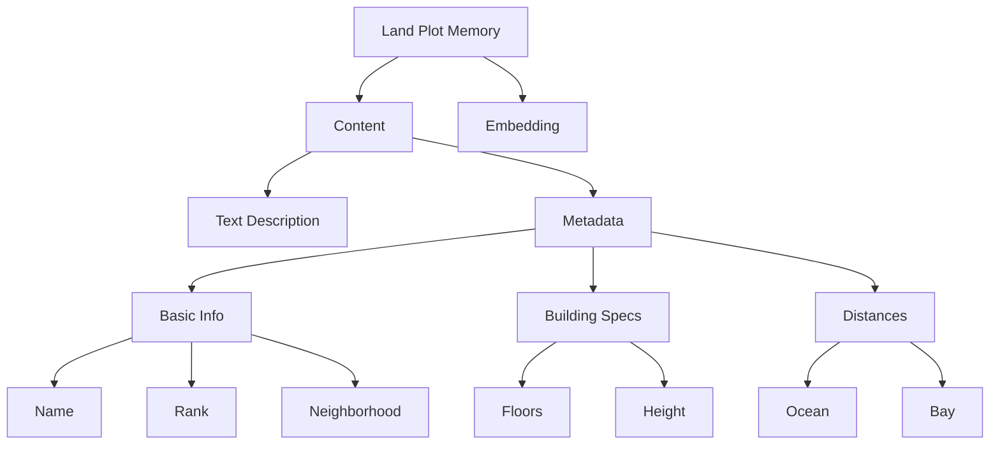
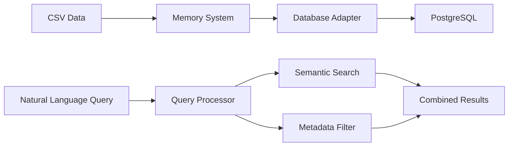

# Land Memory System - High Level Design

## System Overview

The Land Memory System is designed to store, manage, and search virtual real estate data using a combination of semantic search and structured metadata. It extends Eliza's memory system to provide specialized functionality for land plots.

## Core Components

### 1. Data Model

### 2. System Architecture

## Key Features

1. **Semantic Search**
   - Vector embeddings for natural language understanding
   - Similarity-based matching
   - Flexible query processing

2. **Structured Search**
   - Type-safe metadata queries
   - Complex filtering capabilities
   - Performance-optimized database queries

3. **Data Management**
   - CSV data ingestion
   - Automated description generation
   - Structured data validation

## Design Principles

1. **Single Source of Truth**
   - One table for all land data
   - Unified type system
   - Centralized constants

2. **Type Safety**
   - Extensive use of TypeScript enums
   - Structured interfaces
   - Strict type checking

3. **Extensibility**
   - Modular component design
   - Clear interface boundaries
   - Pluggable embedding system

4. **Performance**
   - Optimized database queries
   - Efficient JSON operations
   - Smart result limiting

## System Boundaries

1. **Inputs**
   - CSV data files
   - Natural language queries
   - Structured search parameters

2. **Outputs**
   - Ranked search results
   - Property metadata
   - Error logs and diagnostics

3. **Dependencies**
   - Eliza Memory System
   - PostgreSQL Database
   - Text Embedding Service

## Future Considerations

1. **Scalability**
   - Sharding strategies
   - Caching layer
   - Query optimization

2. **Feature Expansion**
   - Multiple world support
   - Version tracking
   - Real-time updates

3. **Integration**
   - External API support
   - Event system
   - Monitoring and analytics
